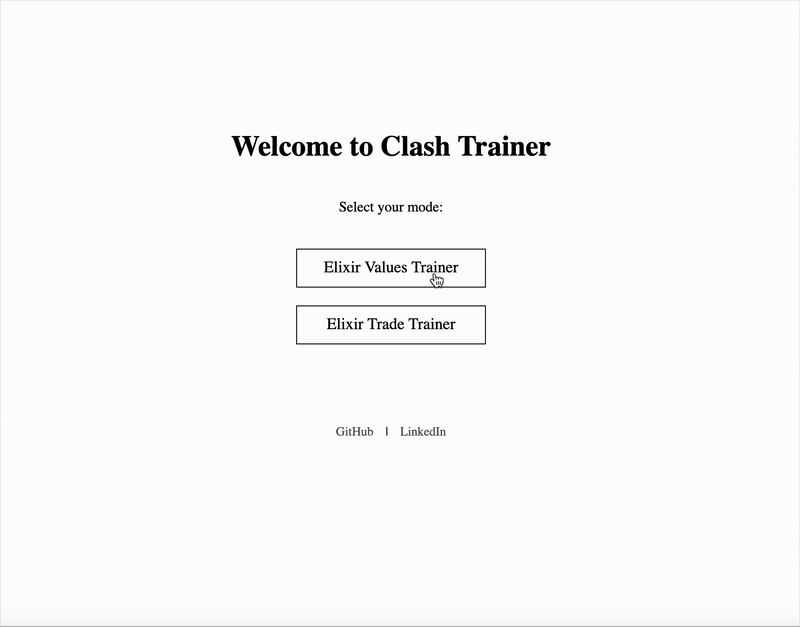

# ClashTrainer

## Description
A simple training tool designed to help players of **Clash Royale** to improve in the game. Currently, the main features revolve around elixir awareness and basic but relevant calculations abilities. 

## Purpose and Scope
Most of the tools build for Clash Royale players so far mainly revolve around deck building and superficial matchup analysis. I believe far more sophisticated and useful tools can be built to help players improve their skills. 
The dream or end goal of this project is to sucessfully incorporate one or multiple models that can create common and relevant game situations, and subsequently not only find, but also explain the best move(s) for each of these situations. I believe this would build the foundation of the best way to improve: pattern recognition and awareness of best moves. 

## Demo

## Project Outline & Features

Currently, the project is planned across these developmental phases:

### 1. Initial Prototype (Terminal Quiz)
* **Goal:** Simple quiz for Clash Royale cards running entirely in the terminal.
* **Mechanism:** User is shown a card name and inputs the correct elixir cost (e.g., Knight → 3).
* **Current Status:** **Implemented.** Uses a JSON card database.

### 2. Elixir Equation Challenges
* **Goal:** Expand the quiz into more strategic, math-based exercises.
* **Mechanism:** Present small scenarios (opponent plays X cards, player plays Y cards) and the user calculates the total elixir balance.

### 3. Web Version
* **Goal:** Move the training platform to a clean, intuitive website.
* **Mechanism:** Display card images and use interactive buttons for input, improving the user experience.

### 4. Advanced Learning Platform
* **Goal:** Add more complex challenges beyond simple elixir math.
* **Mechanism:** Include correct placement challenges using arena images, requiring users to select the optimal tile/placement for given scenarios.

---

## To-Do List

### Phase 1 — Terminal
* [ ] Implement a score tracking system.
* [ ] Introduce mixed difficulty modes.
* [ ] Complete the multi-card elixir trade exercises.

### Phase 2 — Web
* [ ] Develop a simple web UI with integrated card images.
* [ ] Implement the placement challenges.
* [ ] Add user progress tracking and saving (optional).
